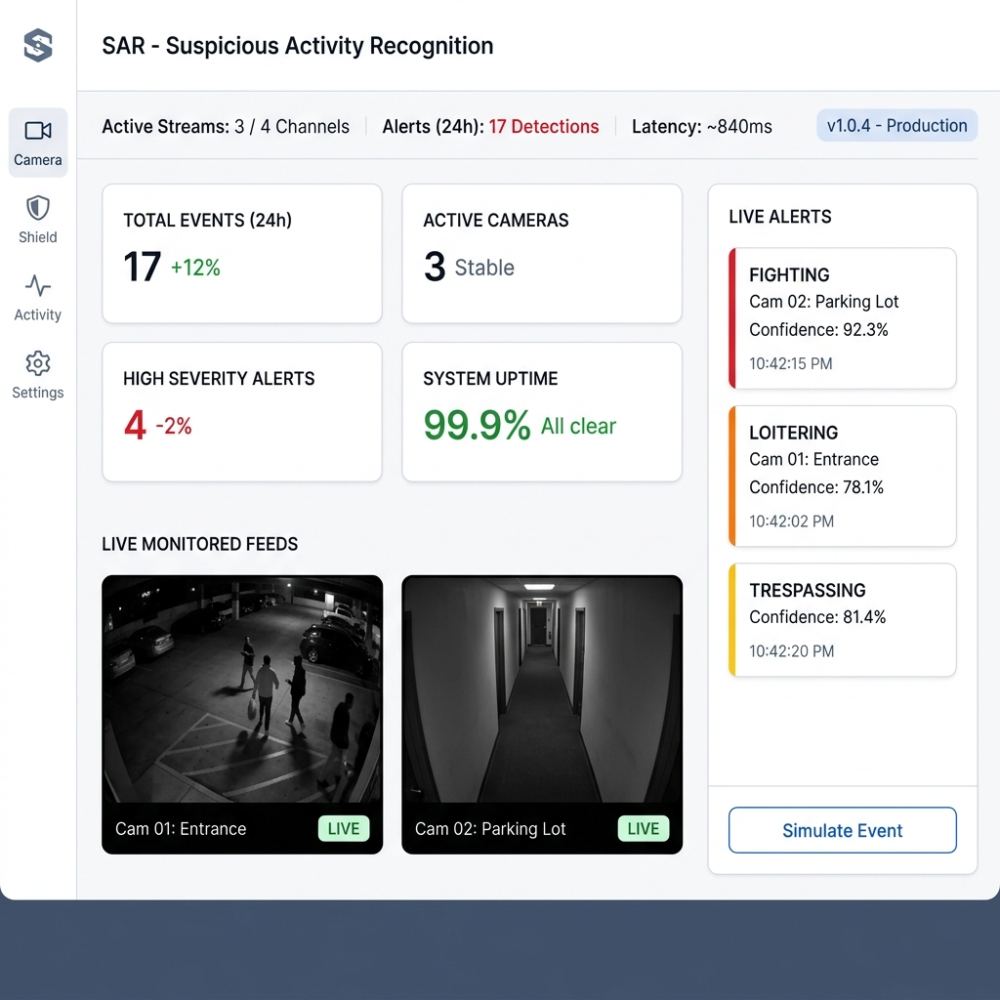
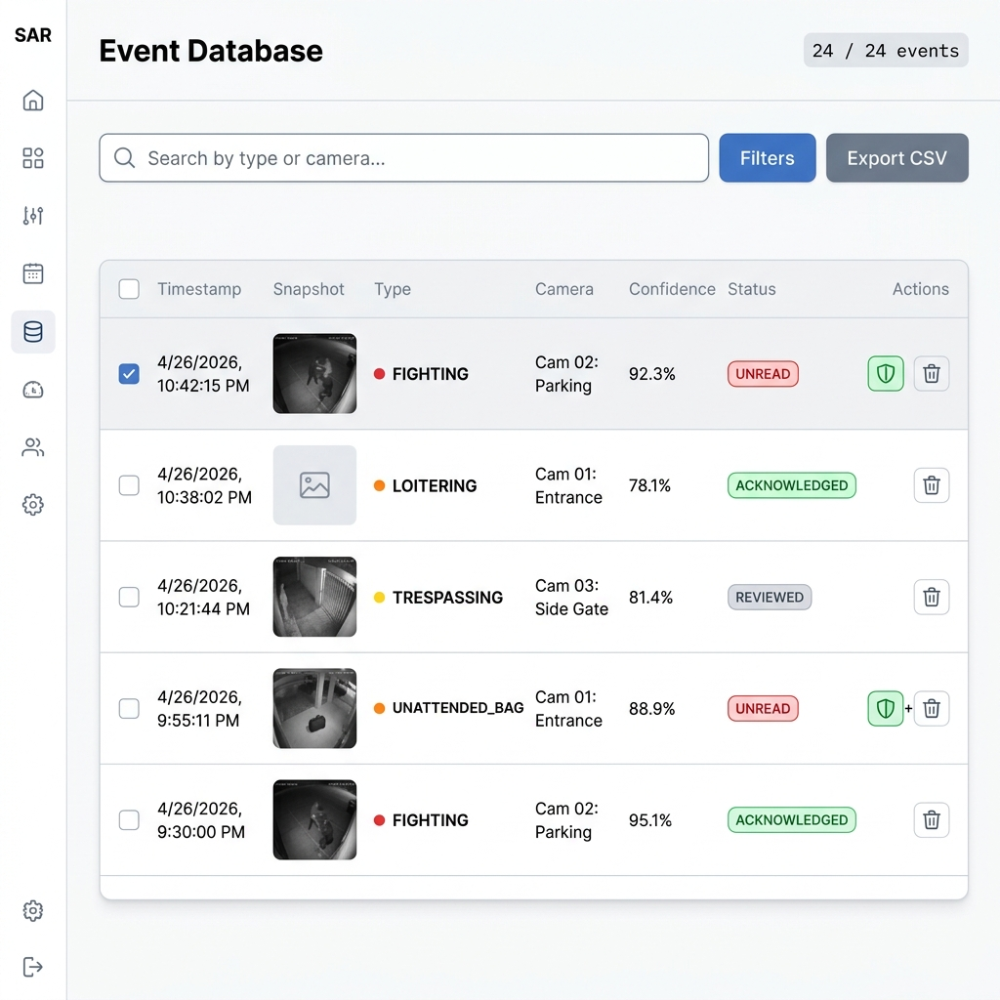
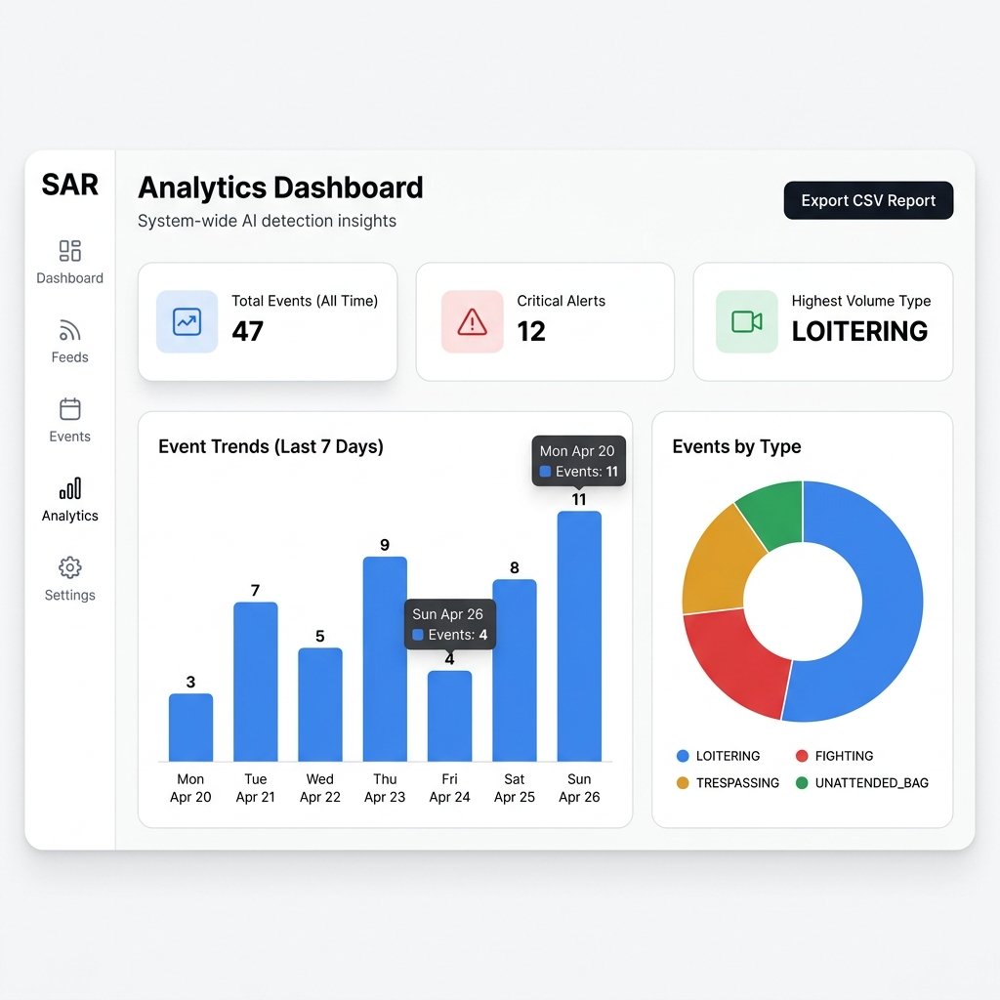
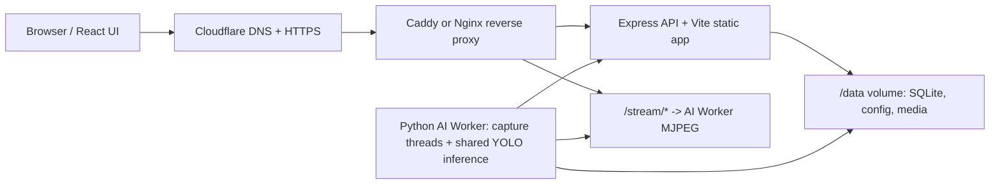

# 🔍 SAR — Suspicious Activity Recognition System

<div align="center">


[](https://react.dev/)
[](https://www.typescriptlang.org/)
[](https://python.org/)
[](https://ultralytics.com/)
[](https://docker.com/)
[](https://nodejs.org/)
[](LICENSE)

**A production-ready, AI-powered security surveillance system for real-time suspicious activity detection across multiple live video feeds.**

</div>


---

## 📸 Screenshots

**Main Dashboard** — Live camera feeds, real-time alert sidebar, and system health stats


**Event Database** — Filterable, searchable log of all AI-detected incidents with snapshot thumbnails and CSV export


**Analytics** — 7-day trend charts, event type breakdown, and KPI summary cards


---

## ✨ Key Features


| Feature                          | Description                                                                             |
| -------------------------------- | --------------------------------------------------------------------------------------- |
| 🎥 **Multi-Camera Processing**   | Concurrent multi-threaded video stream analysis across unlimited cameras                |
| 🧠 **YOLOv8 + ByteTrack**        | State-of-the-art object detection + multi-object tracking pipeline                      |
| ⚡ **Sub-Second Alerts**          | Real-time WebSocket event pushes — dashboard updates in < 1 second                      |
| 🔄 **Hot-Reload Camera Config**  | Add/remove cameras live; AI worker spawns/kills inference threads with zero downtime    |
| 🌐 **Web Stream Extraction**     | `yt-dlp` integration extracts raw feeds from YouTube Live and 1000+ streaming platforms |
| 🗺️ **ROI Polygon Editor**       | Draw custom regions-of-interest per camera; only trigger alerts within defined zones    |
| 🧹 **Automated Storage Pruning** | Background routine purges clips, thumbnails & DB records older than 30 days             |
| 📊 **Analytics Dashboard**       | Historical incident charts, camera uptime stats, and event trend analysis               |
| 🔐 **JWT Authentication**        | Secure login with bcrypt password hashing and token-based session management            |
| 🐳 **One-Command Deployment**    | Fully containerized via Docker Compose — backend, frontend, and AI worker               |


---

## 🏗️ System Architecture

```
┌─────────────────────────────────────────────────────────┐
│                    Browser (React UI)                    │
│  Dashboard │ Live Feeds │ Events │ Analytics │ Settings  │
└──────────────────────┬──────────────────────────────────┘
                       │  REST API + WebSocket (Socket.IO)
┌──────────────────────▼──────────────────────────────────┐
│               Node.js / Express Backend                  │
│  • REST API (cameras, events, config)                    │
│  • JWT Auth + bcrypt                                     │
│  • SQLite via better-sqlite3                             │
│  • WebSocket broadcaster (Socket.IO)                     │
│  • Scheduled storage cleanup (30-day retention)          │
└──────────────────────┬──────────────────────────────────┘
                       │  HTTP polling + POST alerts
┌──────────────────────▼──────────────────────────────────┐
│               Python AI Worker                           │
│  • Dynamic camera thread manager (add/remove live)       │
│  • OpenCV frame capture → YOLOv8 inference               │
│  • ByteTrack multi-object tracking                       │
│  • Rule engine: ROI intersection, loiter timer, etc.     │
│  • MJPEG streaming server (Flask)                        │
│  • yt-dlp integration for web stream sources             │
└─────────────────────────────────────────────────────────┘
```



---

## 🛠️ Tech Stack

**Frontend**

- React 19, TypeScript, Vite 6
- Tailwind CSS v4, Recharts, Framer Motion
- Socket.IO Client, React Hook Form, Zod

**Backend**

- Node.js, Express 4, Socket.IO
- Better-SQLite3, bcryptjs, jsonwebtoken, dotenv

**AI Worker**

- Python 3.10+, PyTorch, Ultralytics YOLOv8
- OpenCV, ByteTrack, yt-dlp, Flask

**Infrastructure**

- Docker, Docker Compose
- Multi-stage builds, volume mounts for persistent media

---

## 📁 Project Structure

```
sar---suspicious-activity-recognition/
├── src/                        # React frontend
│   ├── components/             # AddCameraModal, ROIEditorModal, EventDetailModal
│   ├── pages/                  # Dashboard, Feeds, Events, Analytics, Settings, Login
│   ├── hooks/                  # useWebSocket (Socket.IO integration)
│   ├── lib/                    # auth.ts, utils.ts
│   └── types.ts                # Shared TypeScript interfaces
├── server/                     # Backend modules
│   ├── db.ts                   # SQLite schema + queries
│   └── config.json             # Runtime worker configuration
├── ai_worker/                  # Python inference engine
│   ├── pipeline/
│   │   ├── detector.py         # YOLOv8 + ByteTrack inference loop
│   │   ├── rules.py            # Activity rule engine (ROI, loitering, etc.)
│   │   ├── clip_saver.py       # Video clip + thumbnail writer
│   │   └── mjpeg_server.py     # Flask MJPEG streaming server
│   ├── worker.py               # Worker entry point used by Docker
│   ├── main.py                 # Legacy/demo mock script
│   └── requirements.txt
├── server.ts                   # Express backend entry point
├── build-server.ts             # Production build script
├── docker-compose.yml          # Multi-service orchestration
├── Dockerfile                  # Frontend/backend container
├── .env.example                # Environment variable template
└── vite.config.ts
```

---

## ✅ Prerequisites

**Option 1 (Docker) requires:**
- [Docker](https://docs.docker.com/get-docker/) & Docker Compose v2+
- Git

**Option 2 (Hybrid / local dev) also requires:**
- [Python 3.10+](https://www.python.org/downloads/) with `pip`
- [Node.js 18+](https://nodejs.org/) with `npm`

---

## 🚀 Quick Start

### Option 1 — Docker (Recommended, one command)

```bash
# Clone
git clone https://github.com/Sehaan-1/sar---suspicious-activity-recognition.git
cd sar---suspicious-activity-recognition

# Configure environment
cp .env.example .env
# Edit .env: set JWT_SECRET, INGEST_API_KEY, and initial admin credentials.

# Launch all services
docker compose up --build
```

Open **[http://localhost:3000](http://localhost:3000)** and sign in with the admin credentials you set in `.env`.

### Option 2 — Hybrid (Local webcam testing)

```bash
# Terminal 1: Backend + Frontend via Docker
docker compose up --build backend-frontend

# Terminal 2: AI Worker natively (for webcam access)
cd ai_worker
pip install -r requirements.txt
python worker.py
```

---

## ⚙️ Environment Variables

Copy `.env.example` → `.env` and configure:


| Variable               | Description                       | Default        |
| ---------------------- | --------------------------------- | -------------- |
| `JWT_SECRET`           | Secret key for JWT signing        | — (required)   |
| `INGEST_API_KEY`       | Shared key for worker ingest APIs | — (required)   |
| `PORT`                 | Backend server port               | `3000`         |
| `CLEANUP_MAX_AGE_DAYS` | Days before media is auto-deleted | `30`           |
| `DATA_DIR`             | Runtime DB/config/media directory | `/data`        |
| `WORKER_STREAM_BASE`   | Backend proxy target for MJPEG    | `http://ai-worker:5001` |
| `YOLO_MODEL`           | Worker model file                 | `yolov8n.pt`   |
| `TARGET_FPS`           | Inference FPS per camera target   | `3`            |
| `SEED_SAMPLE_CAMERAS`  | Seed placeholder demo cameras     | `false`        |
| `ADMIN_EMAIL`          | Initial admin account email       | — (optional)   |
| `ADMIN_PASSWORD`       | Initial admin password            | — (optional)   |

`ADMIN_EMAIL` and `ADMIN_PASSWORD` are only used when the users table is empty. If no users exist and those values are omitted, the app starts without seeding an account and logs a warning.

---

## Testing

```bash
npm test
npm run test:python
npm run lint
npm audit --audit-level=moderate
```

The test suite uses Node's built-in test runner for backend/security contracts and Python `unittest` for AI rule behavior.

For a full local container smoke check:

```powershell
./scripts/docker-smoke.ps1
```

---

## SQLite Tradeoff

SQLite is intentional for this capstone because the target deployment is a single Oracle Always Free VM. It keeps setup portable, makes demos easy to reset, and avoids a managed database dependency.

PostgreSQL is the recommended upgrade if the system grows to multiple backend instances, higher write volume, concurrent operators, or production retention/reporting requirements.

---

## Deployment Target

Recommended capstone deployment:

- **Oracle Always Free VM** runs Docker Compose for the backend/frontend and AI worker.
- **Cloudflare Free** handles DNS and HTTPS.
- **Caddy or Nginx** reverse-proxies `/`, `/socket.io`, and `/stream/*`.
- Runtime state lives in the Compose `runtime_data` volume mounted at `/data`.
- The AI worker defaults to `yolov8n.pt` and `TARGET_FPS=3` for CPU-friendly inference.

Colab and Streamlit are useful for experiments or companion demos, but not for hosting the live worker.

---

## Demo Metrics

| Metric | Current target |
| ------ | -------------- |
| Deployment shape | Oracle Always Free single VM + Docker Compose |
| Default model | YOLOv8n (`yolov8n.pt`) |
| Inference scheduler | One shared model, latest-frame round-robin |
| Target inference rate | 3 FPS per camera |
| Persistence | SQLite/config/media under `/data` |
| Validation | `npm test`, Python unittest, TypeScript lint, npm audit |
| Demo media | Screenshots included; record 60-120s MP4 using `docs/demo-script.md` |

---

## 🎯 Engineering Challenges Solved

- **Dynamic thread orchestration** — Camera threads start/stop/restart without restarting the process; a config-diff algorithm detects changes every 10 seconds and takes minimal action.
- **Cross-platform native bindings** — `better-sqlite3` requires native compilation; solved with multi-stage Docker builds pinned to matching Node.js and OS versions.
- **Frame-accurate state tracking** — ByteTrack assigns stable IDs across frames; loiter timers and ROI intersection are computed per-track-ID, surviving brief occlusions.
- **Storage lifecycle management** — A scheduled cleanup job queries events older than the retention window, deletes associated files from disk, then removes DB records — preventing silent disk exhaustion.
- **Web stream compatibility** — `yt-dlp` resolves the actual HLS/DASH manifest from URLs, letting OpenCV open raw streams from YouTube Live, Twitch, and similar platforms without manual URL extraction.

---

## 📄 License

MIT © [Sehaan-1](https://github.com/Sehaan-1)
